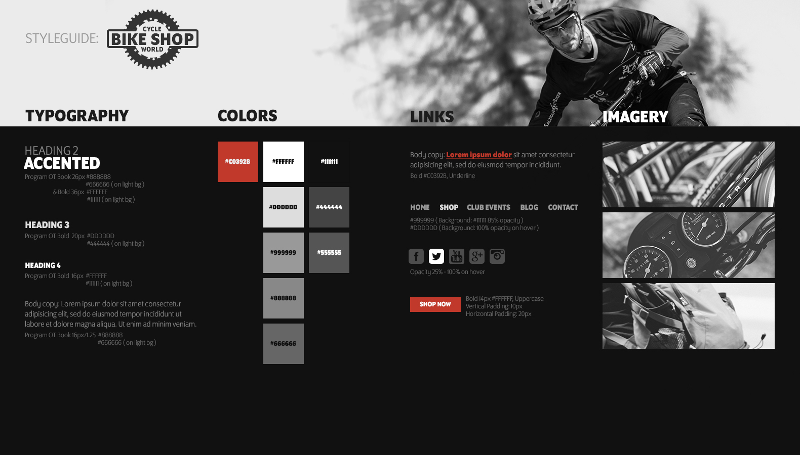

#Front End Styling Resources

##Sites with Fonts (some have paid versions as well)
[1001 Free Fonts](https://www.1001freefonts.com)
[Da Font](https://www.dafont.com)
[Google Fonts](https://fonts.google.com)
[Font space](https://www.fontspace.com/popular/fonts)
[Font Bundles](https://fontbundles.net/free-fonts)
[Font Squirrel](https://www.fontsquirrel.com)

##Color Schemes
[Canva](https://www.canva.com/learn/website-color-schemes/) *(reading material regarding color schemes)*
[Coolors](https://coolors.co)
[Color Hunt](https://colorhunt.co)
[Adobe Color](https://color.adobe.com/create/color-wheel)

##Icons
[FlatIcon](https://www.flaticon.com) *(I can get paid versions, send me a message with a link).*
[Icons8](https://icons8.com/icons/set/website)
[FontAwesome](https://fontawesome.com)

##Front End Components Frameworks
*(These work with Angular)*

[Angular Material](https://material.angular.io/components/categories)
[Bootstrap Angular](https://ng-bootstrap.github.io/#/components/accordion/examples)

###Example Style Guide
 

